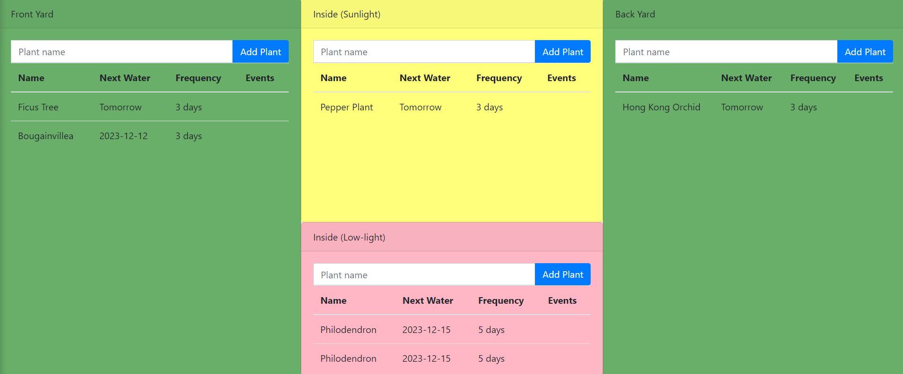
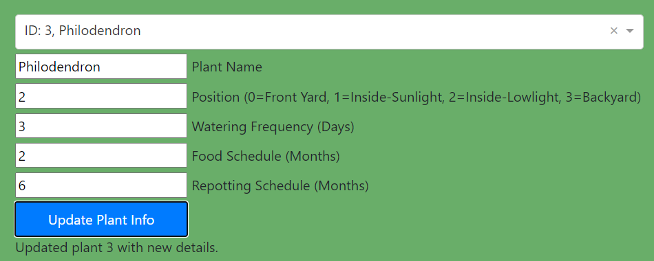

# Sakura
Help keep track of your plants

# Front-end

4 panels: Front Yard, Backyard, Inside (sunlight) and Inside (low-light).
Allows the user to input plant names, then displays the list of plants in each location, sorting those with events (harvest, fertilize, move, or repot) first, then those that need to be watered next.

# Plotly dashboard

Can be reached at `/dashboard/` url. This form allows the user to select any plant in their data and update any of the following fields:
- Name
- Position
- Water frequency
- Food frequency
- Repotting frequency

# Back-end
Parses the input plant name, then queries Perenual API (plants database) to retrieve watering frequency, then adds valid rows to the user's S3 bucket table.
This can easily swap between:
1. The Perenual API and the Trefle API for queries.
2. S3 Data storage or local data storage
